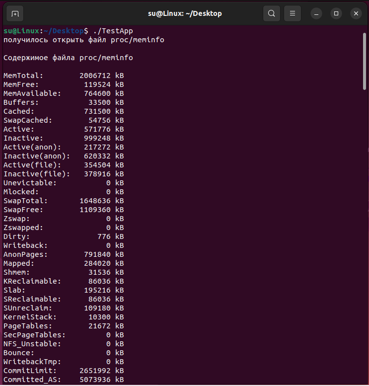
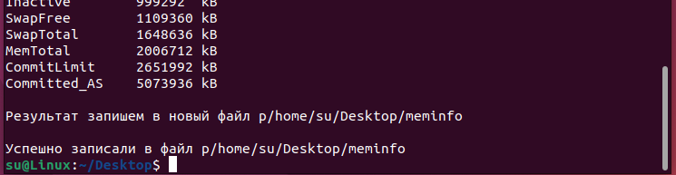
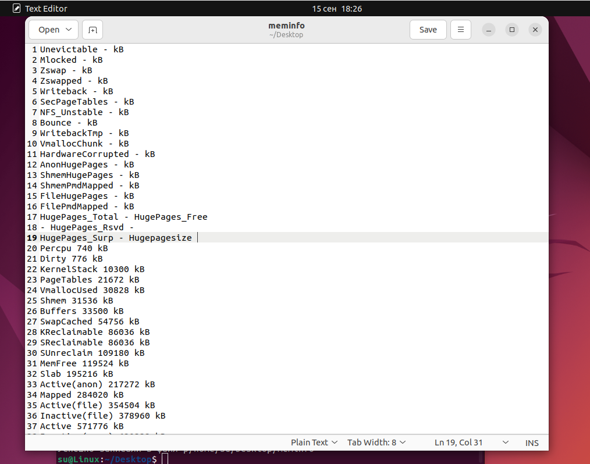

Написать код программы на С++ для ОС Linux. Результат разместить на github.
Программа должна считать данные из файла /proc/meminfo, удалить из текста все символы ":", нулевые значения заменить на прочерк. Результат записать в новый файл, отсортировав строки по объему памяти.

## Готовая программа 

    получившийся файл 

